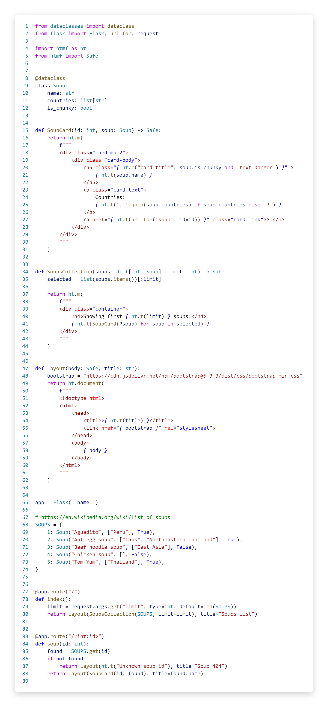

# HTML in Python f-strings

## Introduction

htmf is a collection of utilities for writing HTML in Python f-strings. It works great for typed UI components.

Also it is the suite of tools to boost the developer experience:

- Pylint [plugin](lint.md) checking if expressions are HTML-safe and markup is not soup
- VSCode [syntax highlighter](highlight.md)
- HTML [formatter](format.md)

---
Read the [documentation](https://jkmnt.github.io/htmf)

---

## Installation
```shell
pip install htmf
```

## Working example


<sub>Github markdown doesn't support the syntax highlight for htmf (yet :-), so it's presented as an image here.
</sub>

[Documentation](https://jkmnt.github.io/htmf) site shows this example as proper code and
explains the ideas and motivation.