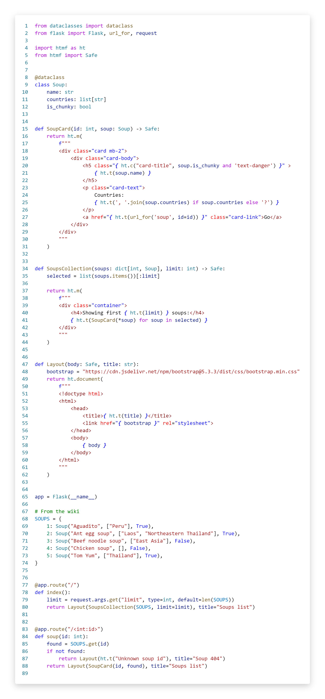

# htmf - HTML in Python f-strings

## introduction

htmf is a collection of utilities for writing HTML in Python f-strings. It works great for HTML-over-the-wire and composable typed UI components.


Also it is the suite of tools to boost the developer experience:
- Pylint plugin checking if expressions are HTML-safe and markup is not soup
- VSCode syntax highlighter
- Code formatter

---
Read the [documentation]()

---

## Installation
```
pip install htmf
```

## Working example


<sub>Github markdown doesn't support the syntax highlight for htmf (yet :-), so it's presented as an image here.
</sub>

[Documentation]() site shows this example as proper code and
explains the ideas and motivation.